# The Desktop Terrarium - Architecture Diagram

## 📐 System Architecture Overview

```mermaid
graph TD
    subgraph User Desktop
        Desktop[User Desktop Screen]
        OtherApps[Other Applications]
        Terrarium[🌿 The Desktop Terrarium]
    end

    Desktop --> OtherApps
    Desktop --> Terrarium
    
    style Terrarium fill:#2ECC71,stroke:#27AE60,stroke-width:2px,color:white
```



---

## 🏛️ Layered Architecture

```mermaid
graph TD
    subgraph Presentation Layer [Terrarium.Desktop - WPF]
        MainWindow[MainWindow]
        Renderer[Renderer]
        SysMon[SystemMonitor]
        
        MainWindow -->|Delegates Rendering| Renderer
        MainWindow -->|Reads Stats| SysMon
    end

    subgraph Logic Layer [Terrarium.Logic - .NET Standard]
        SimEngine[SimulationEngine]
        World[World]
        Entities[Entities]
        Managers[Sub-Managers]
        
        SimEngine -->|Orchestrates| World
        SimEngine -->|Updates| Entities
        SimEngine -->|Uses| Managers
        
        World -->|Contains| Entities
    end

    MainWindow -->|Calls Update()| SimEngine
    Renderer -->|Reads State| World

    style MainWindow fill:#3498DB,stroke:#2980B9,color:white
    style SimEngine fill:#E67E22,stroke:#D35400,color:white
```

---

## 🌳 Entity Inheritance Tree


---

## 🔄 Simulation Loop (Sequence)


